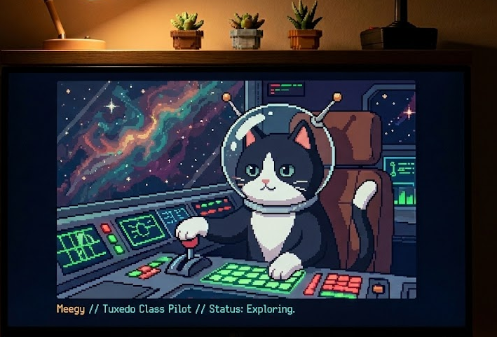

  

# Hello ! Je te souhaite une bonne visite sur mon GitHub :)

### Bref présentation :
Etudiant à la **Web@cadémie d'Epitech à Lille**, je me spécialise pour devenir **Développeuse Web**.

Sur mon temps libre j'aime créer des interfaces webs principalement avec **React**, **JavaScript** et **Tailwind CSS**.
J'apporte toujours une attention particulière aux petits détails qui transforme un projet en un site réussi. 
J'aime peut être y cacher des Easters Egg)

Je suis particulièrement attirée par le **front-end, UX et UI**, mais je sais aussi travailler sur des projets **FullStack**.
Passionnée de jeux vidéox, j’aimerais développer mon propre jeu, en mêlant interface, game design et systèmes de progression.

**À la recherche d’une alternance de 14 mois à partir de septembre**  
**Métropole lilloise / bassin minier**

---

## Stack & outils
### Front-End

### Back-End

### Outils & environnement

---

## Projets en développement

### Meow City
**Jeu incrémental** développé avec React / Vite.  
Travail autour des systèmes de progression, équilibrage, logique de gameplay et interface utilisateur.
**Prototype de jeu idle cozy** visuel mignon et cozy, et d'un sentiment de progression en continu.

---

## Montée en compétence
En ce moment, je travaille sur :
- Apprentissage **React & architecture front-end**
- Création d'interfaces plus interactives & fluides
- Développer mes projets jeux

---

## Me contacter

**LinkedIn** : [linkedin.com/in/alison-dehaies](lien)  
**Portfolio** : [https://meegy-exe.github.io/Portfolio/]
